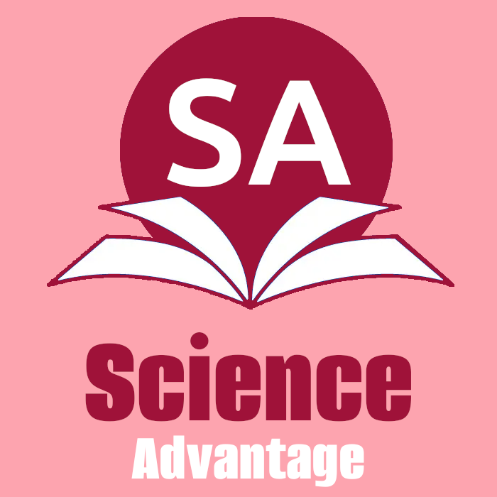

# Science Advantage - The Future of K-12 Science Education

🚀 **Coming 2025** - A comprehensive, standards-aligned science curriculum platform for K-12 education with NGSS alignment, adaptive learning, and 180-day structured instruction.



## 🎯 Mission

Transforming K-12 science education through innovative technology that brings together cutting-edge digital learning with proven educational methods, creating an unparalleled learning experience for students and teachers alike.

## 📌 Core Features

### 📚 Comprehensive Curriculum Coverage

- ✅ **Full K-12 science curriculum** aligned with NGSS disciplinary core ideas
- ✅ **180 days of structured instruction** with grade-appropriate content progression
- ✅ **Cross-curricular connections** integrating real-world scientific discoveries
- ✅ **Standards-aligned assessments** with automated feedback systems

### 🧠 Adaptive Learning System

- ✅ **Three-track difficulty system** (high/medium/low) for personalized learning
- ✅ **Automatic performance-based adjustment** to match student capabilities
- ✅ **Personalized learning paths** within classroom structure
- ✅ **Built-in support systems** for struggling students

### 👥 Teacher Support Features

- ✅ **Comprehensive lesson plans** with customizable content
- ✅ **Class management tools** for streamlined administration
- ✅ **Progress tracking dashboards** with real-time analytics
- ✅ **Professional development resources** and time-saving automation

### 🔬 Modern Learning Experience

- ✅ **Virtual laboratory simulations** with hands-on experiments
- ✅ **Interactive content delivery** with engaging multimedia
- ✅ **Collaborative learning tools** for student engagement
- ✅ **Real-world experiment integration** connecting theory to practice

## 🎨 Design Philosophy

**Science Advantage** is built with a **classroom-first approach**, ensuring seamless integration into existing school systems while providing teachers with the tools they need to succeed.

### Color Scheme

- **Primary Rose**: Rose 300 `#fda4af` / Rose 800 `#9f1239`
- **Design Focus**: Clean, modern interface optimized for educational environments
- **Accessibility**: WCAG 2.1 compliant with screen reader support

## 🏗️ Technical Architecture

### Frontend Stack

- **Next.js 15** with App Router for optimal performance
- **TypeScript** for type safety and developer experience
- **Tailwind CSS** with custom Science Advantage theming
- **shadcn/ui** components for consistent, accessible UI

### Backend Infrastructure

- **Better Auth** for secure, role-based authentication
- **Prisma ORM** with PostgreSQL for robust data management
- **API-first architecture** for scalability and integration
- **Real-time collaboration** features for classroom interaction

### AI-Powered Features

- **OpenAI integration** for personalized content recommendations
- **Adaptive learning algorithms** for student performance optimization
- **Intelligent assessment generation** aligned with learning objectives

## 🚀 Getting Started

### For Schools and Districts

1. **Contact our team** for a personalized demo and implementation plan
2. **Schedule a pilot program** for select classrooms or schools
3. **Professional development** training for teachers and administrators
4. **Roll out implementation** with dedicated support throughout the process

### For Developers

```bash
# Clone the repository
git clone https://github.com/your-org/science-advantage.git
cd science-advantage

# Install dependencies
npm install

# Set up environment variables
cp .env.example .env

# Set up the database
npx prisma migrate dev
npx prisma db seed

# Start the development server
npm run dev
```

## 📊 Target Audiences

### 👩‍🏫 For Teachers

- Lesson planning and management features
- Assessment and tracking tools
- Professional development support
- Time-saving automation

### 🏫 For Administrators

- NGSS compliance tools
- School-wide implementation support
- Progress tracking across classes
- Professional development resources

### 🌍 For Districts

- Standardization across schools
- District-wide analytics
- Implementation support
- Training programs

## 🔧 Technical Requirements

### Device Compatibility

- Works on tablets, laptops, and desktop computers
- Modern web browsers (Chrome, Firefox, Safari, Edge)
- Responsive design for various screen sizes

### Internet Connectivity

- Standard broadband connection recommended
- Cloud-based infrastructure with automatic updates
- Offline capabilities for essential features

### IT Support

- Minimal IT overhead required
- Dedicated technical support team
- Comprehensive documentation and training

## 📈 Implementation Timeline

- **Phase 1**: Pilot program with select schools (Q1 2025)
- **Phase 2**: Beta release with expanded features (Q2 2025)
- **Phase 3**: Full launch with complete curriculum (Q3 2025)
- **Phase 4**: Advanced features and AI enhancements (Q4 2025)

## 🤝 Partnership Opportunities

We're seeking partnerships with:

- **School districts** looking to transform science education
- **Educational technology companies** for integration opportunities
- **Research institutions** for curriculum validation
- **Content creators** for expanding our lesson library

## 📞 Contact & Information

- **Website**: [science-advantage.com](https://science-advantage.com)
- **Email**: info@science-advantage.com
- **Phone**: (555) 123-4567
- **Address**: 123 Education Boulevard, Learning City, LC 12345

## 📄 Resources

- [Sample Lesson Plans](docs/sample-lessons.md)
- [Implementation Guide](docs/implementation-guide.md)
- [Research & Validation](docs/research.md)
- [Case Studies](docs/case-studies.md)
- [API Documentation](docs/api.md)

## 🛣️ Roadmap

### Coming Soon

- [ ] Mobile applications for iOS and Android
- [ ] Advanced analytics dashboard
- [ ] Parent portal for progress tracking
- [ ] Integration with popular LMS platforms
- [ ] Multilingual support

### Future Enhancements

- [ ] Virtual reality laboratory experiences
- [ ] AI-powered tutoring system
- [ ] Advanced collaboration features
- [ ] Custom curriculum creation tools

---

**© 2025 Science Advantage. All rights reserved.**

Made with ❤️ for the future of education by the Science Advantage Team
